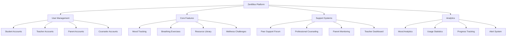

# ZenBliss: Your Digital Wellness Sanctuary 🌿

ZenBliss is a comprehensive mental wellness platform designed to support students in maintaining emotional well-being through interactive tools, peer support, and professional guidance.

## 🎯 Concept Map

## 🔄 Workflow

## 🛠️ Tech Stack

- **Frontend**
  - React 18.3
  - TypeScript
  - Tailwind CSS
  - Lucide Icons
  - Recharts for analytics

- **State Management**
  - React Context API
  - Custom hooks

- **Authentication**
  - JWT-based auth
  - Role-based access control

- **UI/UX**
  - Responsive design
  - Dark mode support
  - Accessibility features

## 🌟 Novelty

1. **Holistic Approach**
   - Integrates mental wellness tracking with academic support
   - Connects students, teachers, and parents in a unified platform

2. **Smart Analytics**
   - Mood pattern recognition
   - Early warning system for stress indicators
   - Personalized wellness recommendations

3. **Safe Space Design**
   - Anonymous peer support
   - Moderated discussions
   - Professional oversight

## 💡 Solution Architecture

### Core Components

1. **User Management**
   - Role-based access control
   - Personalized dashboards
   - Privacy settings

2. **Wellness Tools**
   - Interactive breathing exercises
   - Mood tracking with analytics
   - Guided meditation sessions

3. **Support Network**
   - Peer support forum
   - Professional counseling
   - Parent-teacher communication

4. **Resource Center**
   - Educational materials
   - Self-help guides
   - Wellness activities

## 🚀 Feature Enhancements

### Phase 1: Foundation
- [x] User authentication
- [x] Basic mood tracking
- [x] Resource library
- [x] Breathing exercises

### Phase 2: Community
- [ ] Group challenges
- [ ] Achievement system
- [ ] Community events
- [ ] Peer mentoring

### Phase 3: Advanced Analytics
- [ ] AI-powered mood analysis
- [ ] Predictive stress indicators
- [ ] Personalized recommendations
- [ ] Progress insights

### Phase 4: Integration
- [ ] School system integration
- [ ] Professional network
- [ ] Mobile application
- [ ] API ecosystem

## 📄 License

This project is licensed under the MIT License - see the [LICENSE](LICENSE) file for details.

## 🙏 Acknowledgments

- Mental health professionals who provided guidance
- Educational institutions for feedback
- Open source community for tools and inspiration
  

